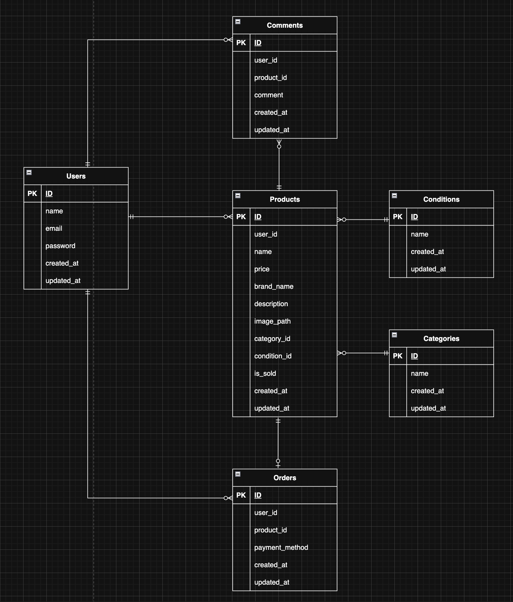

# COACHTECH_FRIMA  

  
## テーブル設計  
※全体設計として、ER図に基づきリレーションを構成しています。
- Users(1) : Products(0または多)
- Users(1) : Comments(0または多)
- Users(1) : Likes(0または多)
- Products(1) : Orders(0または1)
- Products(多) : Conditions(1)
- Products(1) : Comments(0または多)
- Products(1) : Likes(0または多)
- Products(1) : category_product(1または多)
- category_product(多) : Categories(1)
  
| Usersテーブル          |                  |             |            |          |                |
|--------------------|------------------|-------------|------------|----------|----------------|
| カラム名            | 型                | PRIMARY KEY | UNIQUE KEY | NOT NULL | FOREIGN KEY    |
| id                 | unsigned bigint  | ◯           |            | ◯        |                |
| name               | varchar(255)     |             |            | ◯        |                |
| email              | varchar(255)     |             | ◯          | ◯        |                |
| email_verified_at  | varchar(255)     |             |            |          |                |
| password           | varchar(255)     |             |            | ◯        |                |
| image_path         | varchar(255)     |             |            |          |                |
| post_code          | varchar(255)     |             |            |          |                |
| address            | varchar(255)     |             |            |          |                |
| building           | varchar(255)     |             |            |          |                |
| remember_token     | varchar(100)     |             |            | ◯        |                |
| created_at         | timestamp        |             |            | ◯        |                |
| updated_at         | timestamp        |             |            | ◯        |                |


| Productsテーブル       |                  |             |            |          |                |
|--------------------|------------------|-------------|------------|----------|----------------|
| カラム名            | 型                | PRIMARY KEY | UNIQUE KEY | NOT NULL | FOREIGN KEY    |
| id                 | unsigned bigint  | ◯           |            | ◯        |                |
| user_id            | unsigned bigint  |             |            | ◯        | users(id)      |
| condition_id       | unsigned bigint  |             |            | ◯        | conditions(id) |
| name               | varchar(255)     |             |            | ◯        |                |
| price              | unsigned integer |             |            | ◯        |                |
| brand_name         | varchar(255)     |             |            |          |                |
| description        | text             |             |            | ◯        |                |
| image_path         | varchar(255)     |             |            | ◯        |                |
| is_sold            | boolean          |             |            | ◯        |                |
| created_at         | timestamp        |             |            | ◯        |                |
| updated_at         | timestamp        |             |            | ◯        |                |


| Categoriesテーブル   |                  |             |            |          |                |
|--------------------|------------------|-------------|------------|----------|----------------|
| カラム名            | 型                | PRIMARY KEY | UNIQUE KEY | NOT NULL | FOREIGN KEY    |
| id                 | unsigned bigint  | ◯           |            | ◯        |                |
| name               | varchar(255)     |             |            | ◯        |                |
| created_at         | timestamp        |             |            | ◯        |                |
| updated_at         | timestamp        |             |            | ◯        |                |


| Commentsテーブル     |                  |             |            |          |                |
|--------------------|------------------|-------------|------------|----------|----------------|
| カラム名            | 型                | PRIMARY KEY | UNIQUE KEY | NOT NULL | FOREIGN KEY    |
| id                 | unsigned bigint  | ◯           |            | ◯        |                |
| user_id            | unsigned bigint  |             |            | ◯        | users(id)      |
| product_id         | unsigned bigint  |             |            | ◯        | products(id)   |
| comment            | varchar(255)     |             |            | ◯        |                |
| created_at         | timestamp        |             |            | ◯        |                |
| updated_at         | timestamp        |             |            | ◯        |                |


| Conditionsテーブル   |                  |             |            |          |                |
|--------------------|------------------|-------------|------------|----------|----------------|
| カラム名            | 型                | PRIMARY KEY | UNIQUE KEY | NOT NULL | FOREIGN KEY    |
| id                 | unsigned bigint  | ◯           |            | ◯        |                |
| name               | varchar(255)     |             |            | ◯        |                |
| created_at         | timestamp        |             |            | ◯        |                |
| updated_at         | timestamp        |             |            | ◯        |                |


| Ordersテーブル       |                  |             |            |          |                |
|--------------------|------------------|-------------|------------|----------|----------------|
| カラム名            | 型                | PRIMARY KEY | UNIQUE KEY | NOT NULL | FOREIGN KEY    |
| id                 | unsigned bigint  | ◯           |            | ◯        |                |
| user_id            | unsigned bigint  |             |            | ◯        | users(id)      |
| product_id         | unsigned bigint  |             |            | ◯        | products(id)   |
| payment_method     | varchar(255)     |             |            | ◯        |                |
| created_at         | timestamp        |             |            | ◯        |                |
| updated_at         | timestamp        |             |            | ◯        |                |


| Likesテーブル        |                  |             |            |          |                |
|--------------------|------------------|-------------|------------|----------|----------------|
| カラム名            | 型                | PRIMARY KEY | UNIQUE KEY | NOT NULL | FOREIGN KEY    |
| id                 | unsigned bigint  | ◯           |            | ◯        |                |
| user_id            | unsigned bigint  |             |            | ◯        | users(id)      |
| product_id         | unsigned bigint  |             |            | ◯        | products(id)   |
| created_at         | timestamp        |             |            | ◯        |                |
| updated_at         | timestamp        |             |            | ◯        |                |


| category_productテーブル |                  |             |            |          |                |
|--------------------|------------------|-------------|------------|----------|----------------|
| カラム名             | 型                | PRIMARY KEY | UNIQUE KEY | NOT NULL | FOREIGN KEY    |
| id                 | unsigned bigint  | ◯           |            | ◯        |                |
| category_id        | unsigned bigint  |             |            | ◯        | categories(id)  |
| product_id         | unsigned bigint  |             |            | ◯        | products(id)   |
| created_at         | timestamp        |             |            | ◯        |                |
| updated_at         | timestamp        |             |            | ◯        |                |


## 環境構築　　  

### Dockerビルド  
- 作業ディレクトリ上に移動
```bash
  git clone git@github.com:haruki-saitou/coachtech-frima.git
```  
```bash
  docker compose up -d --build
```  

### Laravel環境構築  

```bash
  cp .env.example .env
```
下記の内容に環境変数を変更  
```bash
DB_CONNECTION=mysql
DB_HOST=mysql
DB_PORT=3306
DB_DATABASE=laravel
DB_USERNAME=sail
DB_PASSWORD=password
```
※Apple Silicon (M1/M2/M3) 及び Intel Mac/Windows の両方に対応済みです。  
```bash
  ./vendor/bin/sail up -d
```  
```bash
  ./vendor/bin/sail composer install
```  
```bash
  ./vendor/bin/sail artisan key:generate
```  
フロントエンドのライブラリ（Tailwindなど）をインストール  
```bash
  ./vendor/bin/sail npm install
```  
CSS/JavaScriptをビルド  
```bash
  ./vendor/bin/sail npm run build
```
```bash
  ./vendor/bin/sail artisan storage:link
```
```bash
  ./vendor/bin/sail artisan migrate:fresh --seed
```
```bash
./vendor/bin/sail npm run dev
```
   
### メール認証の設定について  
開発環境でのメールテストには、Mailtrapを使用しています。  
  
- [Mailtrap](https://mailtrap.io/)にログインし、SMTP設定の Integrations から「Laravel 9+」を選択します。
- 表示された以下の情報を、プロジェクトの `.env` ファイルに反映してください。  
`MAIL_HOST`  
`MAIL_PORT`  
`MAIL_USERNAME`  
`MAIL_PASSWORD`  
- これにより、新規登録時の認証メールが Mailtrap の管理画面上で確認できるようになります。
  
### Stripeの設定  
Stripeへログイン  
```bash
https://dashboard.stripe.com/login
```  
設定 → 開発者 → 下記にある標準キーの  
公開可能キー : STRIPE_KEY  
シークレットキー : STRIPE_SECRET  
Stripeのテスト用APIキー(トークン)を `.env` に設定してください。  
```bash
STRIPE_KEY=pk_test_...
STRIPE_SECRET=sk_test_...
```  
### Stripe Webhookの設定（決済状態の自動更新に必要）  
本プロジェクトでは、決済完了（カード・コンビニ等）を正確に検知するためにWebhookを使用しています。  
ローカル環境で動作確認を行うには、以下の手順で Stripe CLI を起動する必要があります。  
   
1. Stripe CLI をインストールしてください。  
2. ターミナルでStripeにログインします。  
```Bash
stripe login
```  
3. Webhookの転送を開始します。  
```Bash
stripe listen --forward-to localhost/stripe/webhook
```  
ターミナルに表示された whsec_ で始まる署名シークレットを `.env` に追記してください。  
```Bash
STRIPE_WEBHOOK_SECRET=whsec_...
```  
※stripe listen を実行している間のみ、決済後の「Sold」状態への自動更新が機能します。  
  
設定を変更したので、`.env`を保存後に設定を反映させるため、ターミナルで以下のコマンドを打ってください。  
```bash
./vendor/bin/sail artisan config:clear
```  
※キャッシュをクリアしたので、そのままブラウザで動作確認してください。
  
## 開発環境　  
MacBook Air M4を使用しています。  
- 会員登録画面: http://localhost/register
- ログイン画面: http://localhost/login
- メール認証誘導画面: http://localhost/email/verify
- 商品一覧画面（トップ画面）: http://localhost/
- 商品詳細画面: http://localhost/item/{item_id}
- 商品出品画面: http://localhost/sell
- 商品購入画面: http://localhost/purchase/{item_id}
- 送付先住所変更画面: http://localhost/purchase/address/{item_id}?payment_method=
- プロフィール画面: http://localhost/mypage
- プロフィール編集画面（設定画面）: http://localhost/mypage/profile
- phpMyAdmin: http://localhost:8080/
  
### テスト用ログイン情報  
- name :
```bash
テストユーザー
```
- email :
```bash
test@example.com
```
- password : 
```bash
password
```
※ migrate:fresh --seed 実行後に利用可能になります。  
  
  
## 使用技術・実行環境  
- **Backend** : PHP 8.5.0 / Laravel 12.43.1
- **Frontend** : JavaScript (Vanilla JS), Tailwind CSS v4.0.0, Vite v7.0.7
- **Database** : MySQL 8.4.7
- **Infrastructure** : Laravel Sail (Docker環境)
- **External APIs** : Stripe API (決済)
- **Tooling** : Node.js v24.11.1, npm
- **Web Server** : Laravel Sail (PHP 8.5.0 Built-in Server) ※将来的にNginx導入予定

  
## 動作確認フロー
1. `http://localhost/register` で新規会員登録を行う。
2. `Mailtrap` に届く認証メール内のリンクをクリックする。
3. 自動でプロフィール設定画面へ移動することを確認後、「画像」、「郵便番号」、「住所」、「建物名」を登録する。
4. 商品を出品し、画像が表示されるか確認する。
5. Stripeのテスト
カード番号 : 4242 4242 4242 4242  
有効期限 : 未来の日付であれば問題ありません。
cvc : 適当な番号で問題ありません。

## 一覧表示仕様
- 取得方式：JavaScript (fetch API) による無限スクロール
- 読み込み単位：1ページ 20件 (paginate(20))
  
## ER図  

